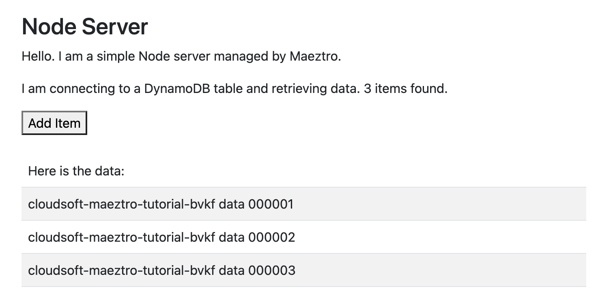

# Deploying a Sample Application with Terraform

You will notice the `main` branch of this project has three folders:

```shell
├── docs/       # This documentation
├── deploy/     # The deployment we will work with, Terraform, NodeJS, etc; described below
└── stages/     # Files for the changes made at each stage of deployment (if you prefer to copy)
```

The `deploy/` folder contains the source code for our application, Terraform files, and scripts and keys needed for deployment:

```shell
└── deploy
    ├── dynamo-table.tf  # Terraform configuration for the DynamoDB table.
    ├── misc.tf          # Terraform configuration for misc shared resource, a private key and random salt.
    ├── nodejs-server.tf # Terraform configuration for the EC2 instance hosting the NodeJS application.
    ├── output.tf        # Terraform outputs
    ├── providers.tf     # Terraform version and provider (AWS) version and configurations.
    ├── variables.tf     # Terraform user inputs and their default values where possible
    ├── scripts          ## Bash scripts for customizing the EC2 instance
    │   ├── configure.sh # Set up the .env variables used by the app
    │   ├── create.sh    # Download and installs NodeJS and NPM
    │   ├── restart.sh   # Stop the app if running and restart it
    │   ├── start.sh     # Starts the NodeJS application
    │   └── stop.sh      # Stops the NodeJS application
    └── src              ## Source code for the NodeJS web application
        ├── package.json # Declares NodeJS dependencies and versions 
        └── server.js    # The NodeJS application source code
```

This tutorial does not assume familiarity with Terraform, bash, or NodeJS, but if you are curious you can look at those files.

We will work in the `deploy/` folder for this tutorial, but if you prefer to work in a copy you make of that folder or use a git branch, that is fully supported.

Go ahead and check out the project if you have not done so and open a shell in the `deploy/` folder:

```shell
git clone git@github.com:cloudsoft/node-with-dynamo.git
cd node-with-dynamo
cd deploy
ls
```

If you see the `*.tf` files, you're ready to go.


## Configuring the Terraform Deployment Variables

The `variables.tf` file defines the variables used to deploy and configure the application.  Two of these variables, `aws_access_key_id` and `aws_secret_access_key`, need to be set in order for Terraform to communicate with AWS to set up the infrastructure, for the NodeJS application to access DynamoDB, and for the Maeztro management you will write to read metrics from AWS and access DynamoDB.

These two variables must be set correctly for your environment. We recommend setting them in a `local.auto.tfvars` with the following format:

```properties
aws_access_key_id = "AKIAXyour_access_key"
aws_secret_access_key = "s3cr3ts3cr3ts3cr3ts3cr3ts3cr3ts3cr3tp455"
```

**Note:** This approach is the simplest for getting started. In production you will likely want to store credentials in an external secret store, or use environment variables, instance profiles, IAM roles or STS tokens: these are all supported.

The `prefix_identifier` value is used to name and tag all resources. By default it is set as `cloudsoft-maeztro-tutorial` so that all the resources created in AWS will be clearly labelled. If desired, you can set this in your `local.auto.tfvars` to a string which also identifies you.

The other variables can be left as is, or you can provide preferred values following the comments in the TF files. (Note that if you change the `region` from `eu-north-1`, you will have to change the `ami_id`; the scripts are designed against Ubuntu 20.)


## Apply the Terraform

Now we are ready to initialize our Terraform local environment and `apply` the Terraform configuration to create the deployment in AWS:

```shell
terraform init
terraform apply --auto-approve
```

When all goes well, the last lines in the output should look similar to those below.

```shell
Apply complete! Resources: 11 added, 0 changed, 0 destroyed.

Outputs:

data_table_arn = "arn:aws:dynamodb:eu-north-1:304295633295:table/cloudsoft-maeztro-tutorial-srbg-data-table"
data_table_name = "cloudsoft-maeztro-tutorial-srbg-data-table"
server_main_uri = "http://13.50.166.213:3000"
```

You can now use `terraform show` to inspect the state of the deployment, you can access the NodeJS application at the URL returned as a value for the `server_main_uri` output.



Visit the application at this endpoint and observe how the button allows records to be added to the DynamoDB database. Don't add too many records yet though, as you might trigger a bug in the application which we're going to resolve in this tutorial!

You are now ready for [the next step](2-grouping.md) where we will start to use Maeztro.
