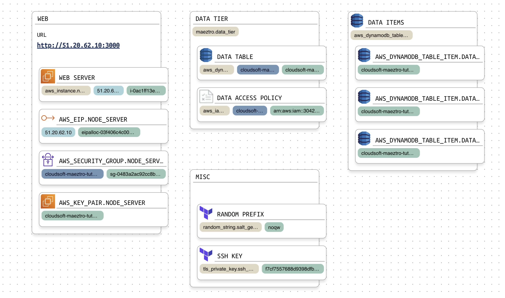
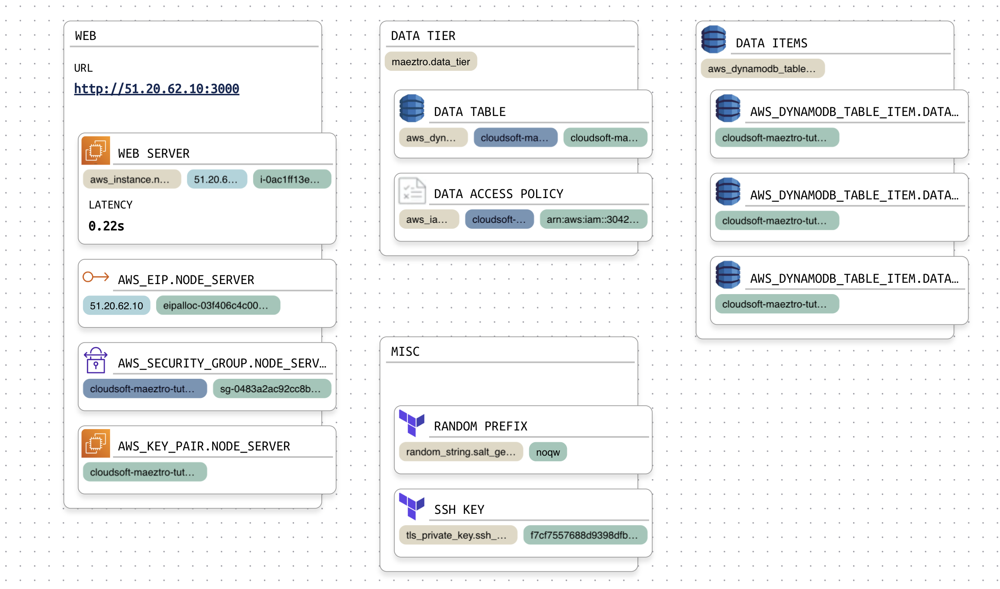
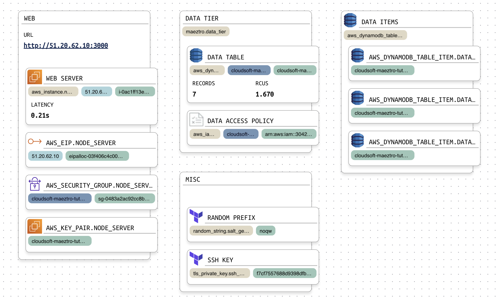

# Showing State Using Sensors

Cloudsoft AMP lets you define "sensors" to report information about the current state of a resource, a group, or the overall system. Maeztro allows these to be defined in the `resource` definition in the `*.mz` files.

Sensors can report any information that might be useful, taken from any source either periodically or on a trigger. This can surface important aspects from the Terraform state or code, which Maeztro has, or pull from the resource, the cloud, or your monitoring or ITSM system.
AppDynamics, New Relic, Dynatrace, prometheus, and CloudWatch are all supported.
You can make HTTP calls, run containers or shell scripts, Ansible playbooks, Cutover and other workflow systems.

This section will show you how to write four sensors:

- one that simply makes the URL for the application easily accessible
- one that makes a web call and reports request latency
- one that queries the DynamoDB resource and publishes the number of records in the DynamoDB table
- one that reads from AWS CloudWatch to publish the number of read capacity units for the DynamoDB table

## Sensor Publishing the Application URL

When you have a resource that hosts a web application, you might want to provide a quick way to access the application, to check that everything is indeed good and ready to go. We will define in Maeztro a sensor for the application's main URL and a widget to display it.

Edit the `*.mz` file where you defined `resource "maeztro" "web"` and add the sensor and widget blocks as below,
(taking care to only copy those two sub-blocks in the below, between the `add` and `end` comments).

```hcl
resource "maeztro" "web" {
  name = "Web"
  position_in_parent = [ 100, 100 ]

  # add a sensor for the URL and a widget to show it
  sensor "main_url" {
    output = "http://${aws_instance.node_server.public_ip}:${var.port}"
  }
  widget sensor "main_url" {
    label = "URL"
  }
  # end of sensor and widget blocks to insert
}
```

Run `mz apply` and you should see the URL displayed in the UI.

The block ID `main_url` defines the sensor to collect and, for the widget, to display. The `output` attribute is a simple Terraform expression referencing the `public_ip` attribute on `aws_instance.node_server` and the `var.port` we defined, concatenating these to make a URL. The `label` is simply the text to show alongside the sensor's value in the UI.

This example is almost identical to the Terraform `output`. In fact, it is using the same `http://${...}` expression as in `output.tf`, and here we could have simply referred to the Terraform output. However sensors are designed to do much more, to surface the real-time information needed for in-life management:

* We can specify _how_ the values should be retrieved and/or computed by defining `steps` to run, invoking containers, web calls, scripts, or playbooks
* We can specify _when_ the values should be updated using `triggers` or `period` and optionally a `condition`
* We can attach sensors to specific resources, either from Terraform or Maeztro groups we introduce
* We can use sensors as triggers for other operations

These capabilities enable Maeztro to be used to give an augmented picture of the overall application, individual "real" resources, and the architectural groups we defined. Sensors allow us to collect and present metrics, information, compliance, and errors from whatever sources matter. The next examples show more interesting sensors, and the next sections of this tutorial will show how we can use them to automate operations.



## Latency Sensor

Suppose we are part of the operations team looking after this application.
One of our concerns will typically be to ensure a good experience for users,
including a low latency when they make requests.
Let's add a sensor to collect and show the latency of requests coming to the server.

As this information is specific to the web server resource, we will edit the `maeztro extend resource "aws_instance.node_server"` block to include the following `sensor` and `widget` definitions:

```hcl
maeztro extend resource "aws_instance.node_server" {
  name = "Web Server"
  parent = maeztro.app_tier
  display_index = 0

  sensor "request_latency" {
    steps = [
      "http ${maeztro.web.main_url}",
      "return ${output.duration}"
    ]
    period = "5s"
    type = "duration"
    on-error = [
      "return null"
    ]
  }
  widget sensor "request_latency" {
    label = "Latency"
  }
}
```

This shows the use of AMP workflow `steps` to make a request against the URL we just defined. The `http` step makes a request and returns an `output` object containing the `content` as well as the `duration`. Notice we can access sensors in Maeztro in the same way we access Terraform attributes. For this example, we're collecting the sensor every five seconds and we're specifying that the sensor is a duration. We've also supplied an error handler to return `null`, effectively clearing the sensor, if there is an error.

We used the simple built-in `duration` field so that this tutorial doesn't need you to set up external monitoring, but often in the real world this type of metric will come from a third-party monitoring tool. The exact same principles apply, a workflow step pulls the data from the monitoring source or sources, with an `http` call or using `shell` or `ssh` script or container. You will see examples of this below. 

**Note:** Because it is used so frequently in operations and compliance, Maeztro understands `duration` as a first-class type, along with `timestamp`. This is used here for the `period`, and as we'll see very shortly, these types can also be used for mathematics where things are time-sensitive.



With an `mz apply`, you should now see something similar to the above in the Maeztro UI.

Click in the NodeJS application we deployed to add a few more data items, and you should start to see the latency increase.


## Data Table Item Count Sensor

With our operator's hat on, we want to understand -- and resolve -- the problem of latency increasing.  We have a suspicion that this is due to the number of entries in our database, so let's add a sensor for that.

As this application uses DynamoDB, we can use the `aws` CLI to query the data table. We will use the `shell` step to run the CLI in the server where Maeztro is running. If you are using a production deployment this may be disabled, and you should use the alternate syntax shown in the "Note" below.

We also need to provide the AWS credentials for the CLI. As we stored these as Terraform variables, we can again simply refer to those variables. If you used one of the alternatives covered [here](secrets.md), you may need to adjust the code accordingly.

Cloudsoft AMP's workflow syntax allows a string shorthand for steps that are fairly simple, or a longhand "map" syntax for more elaborate steps. Here, as we are providing environment variables, the `shell` step is written in longhand.  The code for this sensor, attached at the Maeztro extension to `aws_dynamodb_table.data_table`, is as follows:

```hcl
maeztro extend resource "aws_dynamodb_table.data_table" {
  name = "Data Table"
  parent = maeztro.data_tier
  display_index = 0
  
  sensor "data_count" {
    steps = [
      {
        step: "shell aws dynamodb scan --table-name ${self.name} --select COUNT"
        env: {
          AWS_ACCESS_KEY_ID : var.aws_access_key_id
          AWS_SECRET_ACCESS_KEY : var.aws_secret_access_key
          SESSION_TOKEN : var.aws_session_token
          AWS_DEFAULT_REGION: var.region
        }
      },
      "transform ${stdout} | type map",
      "return ${Count}"
    ]
    period = "10s"
  }
  widget sensor "data_count" {
    label = "Records"
  }
}
```

**Note:** If you are using an AMP deployment with `kubectl` configured, you can replace the `step: shell aws dynamodb ...` entry with two entries, `step: container amazon/aws-cli` and `args: dynamodb ...`. The same `env` should be supplied. This can be used to run any permitted container.


## Data Table Read Capacity Units Sensor

As an operator, we might also suspect that the problem is related to the "read capacity units" (RCUs) consumed against the data table.  This value can be retrieved from AWS CloudWatch, using a step very similar to the one we just showed. However the AWS CLI syntax for CloudWatch is more complicated, so this is a good opportunity to show some more advanced capabilities of workflow. This can also be considered as an illustration of the use of other tools to collect sensors from other sources. The workflow below computes the ISO 8601 codes for a five-minute window ending whenever the workflow is run and supplies them as arguments to the `cloudwatch get-metric-statistics` command, and then parses the result as a JSON object and extracts the average:

```hcl
    steps = [
      "let now = ${workflow.util.now_instant}",
      "transform ${now} | to_string | set now_str",
      "let duration five_minutes = 5m",
      "let five_minutes_ago = ${now} - ${five_minutes}",
      "transform ${five_minutes_ago} | to_string | set five_minutes_ago_str",
      {
        step: "shell"
        command: join(" ", ["aws cloudwatch get-metric-statistics",
          "--namespace AWS/DynamoDB  --metric-name ConsumedReadCapacityUnits",
          "--dimensions Name=TableName,Value=${self.name}  --statistics=Average",
          "--start-time ${five_minutes_ago_str} --end-time ${now_str} --period 300"])
        env: local.aws_cli_env
      },
      "transform ${stdout} | type map | set aws_stats",
      "return ${aws_stats.Datapoints[0].Average}"
    ]
```

Again we have to supply the `AWS_*` environment variables, and rather than repeat these, we can store and reference these as `locals` for Maeztro, just as in Terraform. We can also use the `join` function to break up the now quite-long CLI arguments.

The final Maeztro configuration for the `aws_dynamodb_table.data_table` should look like the following (replacing any `data_count` sensor definition blocks you might have experimented with in the previous subsection):

```hcl
maeztro extend resource "aws_dynamodb_table.data_table" {
  name          = "Data Table"
  parent        = maeztro.data_tier

  sensor "data_count" {
    steps = [
      {
        step: "shell aws dynamodb scan --table-name ${self.name} --select COUNT"
        env:  local.aws_cli_env
      },
      "transform ${stdout} | type map",
      "return ${Count}"
    ]
    period = "10s"
  }
  widget sensor "data_count" {
    label = "Records"
  }
  
  sensor "avg_consumed_read" {
    steps = [
      "let now = ${workflow.util.now_instant}",
      "transform ${now} | to_string | set now_str",
      "let duration five_minutes = 5m",
      "let five_minutes_ago = ${now} - ${five_minutes}",
      "transform ${five_minutes_ago} | to_string | set five_minutes_ago_str",
      {
        step: "shell"
        command: join(" ", ["aws cloudwatch get-metric-statistics",
          "--namespace AWS/DynamoDB  --metric-name ConsumedReadCapacityUnits",
          "--dimensions Name=TableName,Value=${self.name}  --statistics=Average",
          "--start-time ${five_minutes_ago_str} --end-time ${now_str} --period 300"])
        env: local.aws_cli_env
      },
      "transform ${stdout} | type map | set aws_stats",
      "return ${aws_stats.Datapoints[0].Average}"
    ]
    period = "10s"
  }
  widget sensor "avg_consumed_read" {
    label = "RCUs"
  }
}
```

And add the following `locals` block either in the `dynamodb-table.mz` file or the `misc.mz` file:

```hcl
locals {
  aws_cli_env = {
    AWS_ACCESS_KEY_ID : var.aws_access_key_id
    AWS_SECRET_ACCESS_KEY : var.aws_secret_access_key
    SESSION_TOKEN : var.aws_session_token
    AWS_DEFAULT_REGION: var.region
  }
}
```

The changed files for this are in `../stages/3-sensors/`, so if you want to copy across the worked solution, do: `cp ../stages/3-sensors/*.mz ./`

With these defined, run `mz apply`:



Now as records are added, the sensors show conclusively what we expected, that latency is increasing as the record count is increasing. We can also see that the RCU's are not actually relevant.

How can we fix that? Maybe restarting the server? Maybe clearing out the datatable. Advance to [the next step in the tutorial](4-effectors.md) to learn how to do both of these with AMP **effectors**.

