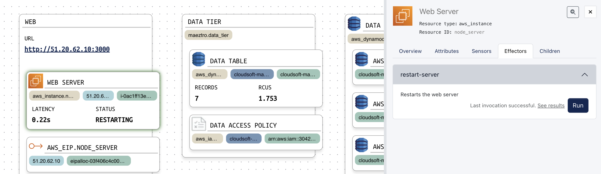

# Adding Behaviour using Effectors

Just knowing the state of our resources is not enough; being able to take action to control the state is much more powerful. Adding behaviour to Maeztro resources can be done via `effectors`. 

An effector in AMP is a workflow with a name and optional arguments, associated to a resource.  In Maeztro, these are defined in `effector` blocks in your `*.mz` files exactly as sensors are, such as the following:

```hcl
maeztro resource "sample" {
  effector "effector-name" {
    steps = [
     "log workflow steps go here..."
    ]
  }
}
```

## Restart the NodeJS Server

Let's now write our first effector. Empirically, the operations team have found that simply restarting this NodeJS app fixes the latency, at least for a short while. Of course they've added a backlog item to try to fix the underlying problem but (although it's not at all hard) the team haven't been able to prioritize it. So the ops team want an effector that restarts the NodeJS process.

There is already a `restart.sh` script provided as part of the installation, and Maeztro can use the `connection` information already defined in Terraform, so writing this effector is as simple as adding the following `effector` block to `aws_instance.node_server`:

```hcl
maeztro extend resource "aws_instance.node_server" {
  
  // ... (name, parent, sensors unchanged)

  effector "restart-server" {
    description = "Restarts the web server"
    steps = [
      "ssh sudo /tmp/restart.sh ${var.port}",
    ]
  }
}
```

Run `mz apply`, then click on the "Web Server" resource, click the "Effectors" tab at right, and you'll see the new `restart-effector`. Ensure you have added a dozen or more items so the latency is high. Now expand the effector to see the `description` we added above and click "Run". After a few seconds, the latency may go blank while the server is restarting (because we said `on-error: [ "return null" ]`); but shortly it should be back to the normal "good" level.  We've fixed the problem!

Effectors allow us to encode common operations as part of the blueprint, exactly as sensors allow us to encode the monitoring information. Just as sensors can come from any sources, effectors can run anything anywhere, using containers or HTTP, ssh scripts or playbooks. Effectors can use any Terraform expressions so can access context such as IP addresses, ARNs, `file(key)`, or sensors. They can take parameters (as we'll see in the next example), and can be invoked via the CLI or the AMP API. 

Of course we could have tainted the Terraform resource and run another Terraform `apply`; that is a common practice and often a good idea, and it is something AMP can do via effectors. In this case the SSH script is much faster, seconds as opposed to minutes, and as it turns out neither is a permanent solution. Within a minute or two, latency will be back up to its pre-restart levels.

Before we try to fix that, let's add a visual indicator while it is restarting. AMP workflow can update sensors, in addition to containers and scripts, so we can do this by adding a sensor and widget and editing the effector definition as follows:

```hcl
maeztro extend resource "aws_instance.node_server" {
  
  // ... (name, parent, sensors unchanged)

  effector "restart-server" {
    description = "Restarts the web server"
    steps = [
      "set-sensor status = RESTARTING",
      "ssh sudo /tmp/restart.sh ${var.port}",
      "set-sensor status = RUNNING"
    ]
    lock = "restart_effector_active"
  }
  sensor "status" {
    output = "RUNNING"
  }
  widget sensor "status" {}
}
```

Notice also that we've added a `lock` attribute: the named `lock` acts as a mutex, that is it ensures only one instance of a workflow can run with a given lock at any one time. Here this is used to prevent another "restart" from being invoked while we are restarting, as that could result in mistaken "status" messages; instead the second invocation will wait until the first one completes. (For those familiar with mutexes, the lock here is scoped to the resource, applying across other instances of the same effector and other effectors, sensors, and policies at this entity. It is also possible to point at a lock on a specific entity or ancestor to share a lock across multiple resources.)

By now we've probably waited long enough that the "fix" of our previous restart has worn off, and latency is high again. Run `mz apply` and then invoke the new effector. It should again fix the problem, temporarily, and now also indicate that it is restarting.




## Remove Old Database Records

Noticing the latency is related to the record count, we did some more investigation and found that removing old items from the database seems to fix the problem permanently, at least until the record count is increased. So let's add an effector to the `aws_dynamodb_table.data_table` resource that removes old items.

For this, we'll use the `aws` CLI again. We need to first find the largest indexed item, then find the keys for all the records we want to delete, and then delete those keys. The effector below does this, showing more sophisticated techniques including converting JSON `${stdout}` text to objects, accessing fields on these objects, converting to integers or JSON-encoded bash strings embedded into the `aws dynamodb` command. There is even a `foreach` step looping with concurrency.

**Note:** This is intentionally a complex example showing some powerful features which can be very useful for real-world operations, but if you are not familiar with the `dynamodb` CLI, don't panic at the details; simply copy and paste the steps. A lot can be done without these complex operations, and when you need them, you can return to this example and the documentation. Users familiar with the nuances of sending JSON via the AWS CLI will hopefully appreciate how Maeztro provides a near-optimal way to represent what needs to be done.  Still, writing a short program to run in a container might be a better way. There is a balance to be struck; just because AMP workflow can do complex things doesn't necessarily mean it should. As a rule of thumb, use workflow when you want to update the Maeztro model with sensors and when you want high-level visibility of operations, and use code in a container or external script when the logic becomes unwieldy in a workflow or you want to test it atomically.

Add the code below to `dynamodb-table.mz`, run `mz apply`, and then invoke this new effector. This time you'll see the latency go down -- and stay down! -- until new records are added.

```hcl
maeztro extend resource "aws_dynamodb_table.data_table" {

  // ... (name, parent, sensors unchanged)

  effector "delete-old-web-items" {
    description = "Deletes from ${self.name} the oldest web items"
    parameter "records_to_keep" {
      type = "integer"
      default = 3
    }
    steps = [
      {
        name: "Find largest index"
        step: "shell"
        command: join(" ", ["aws dynamodb query --table-name ${self.name}",
          "--projection-expression SORT_KEY --max-items 1 --key-condition-expression HASH_KEY=:web",
          "--expression-attribute-values '{\":web\":{\"S\":\"web\"}}' --no-scan-index-forward"])
        env: local.aws_cli_env
      },
      "let map max_record = ${stdout}",
      "let integer max_record_index = ${max_record.Items[0].SORT_KEY.N}",
      "let keep_from_index = ${max_record_index} + 1 - ${records_to_keep}",

      {
        step : "let values_obj"
        value : {
          ":web" : {
            S : "web"
          }
          ":keep_from_index" : {
            N : tostring(keep_from_index)
          }
        }
      },
      "transform ${values_obj} | bash | set values",
      "let condition = HASH_KEY=:web and SORT_KEY<:keep_from_index",
      {
        name: "Find records to delete"
        step: "shell"
        command: join(" ", ["aws dynamodb query --table-name ${self.name} ",
          "--projection-expression HASH_KEY,SORT_KEY --key-condition-expression \"${condition}\"",
          "--expression-attribute-values ${values}"])
        env:  local.aws_cli_env
      },

      "let map data = ${stdout}",
      {
        step: "foreach key in ${data.Items}"
        name: "Delete each record"
        concurrency: 5    # allow up to 5 concurrent deletions
        steps: [
          "transform ${key} | bash | set key_string",
          {
            name: "Delete record ${key_string}"
            step: "shell"
            command: "aws dynamodb delete-item --table-name ${self.name} --key ${key_string}"
            env: local.aws_cli_env
          }
        ]
      },
      "set-sensor data_count = -1"
    ]
  }
}
```

These changes for this can be copied with: `cp ../stages/4-effectors/*.mz ./`


**Note (advanced):** AMP tracks a lot of data on resources under management and on the activities it undertakes. A live view and audit trail is available in the "Inspector", available via the magnifying glass icon in the right-hand-side view or the "nine-dots" menu in the top-right.  The `aws_dynamodb_table.data_table` Activities tab will show every step of the workflow above, including the `stdout` stream from `shell` and `ssh` commands, values of variables through the workflow, and the tree of subtasks launched as part of the `foreach` task.  You can re-run workflows from particular points on failure, run ad hoc workflows interactively (useful for testing new workflows, using the YAML syntax), and set them up in mission-critical resilience scenarios to resume even if AMP itself fails over.   

Effectors are powerful -- but can you guess what is even more powerful? That's right, running them automatically when problems appear. This is what AMP **policies** do. To learn how to do this, continue to [the next step in the tutorial](5-policies.md).

