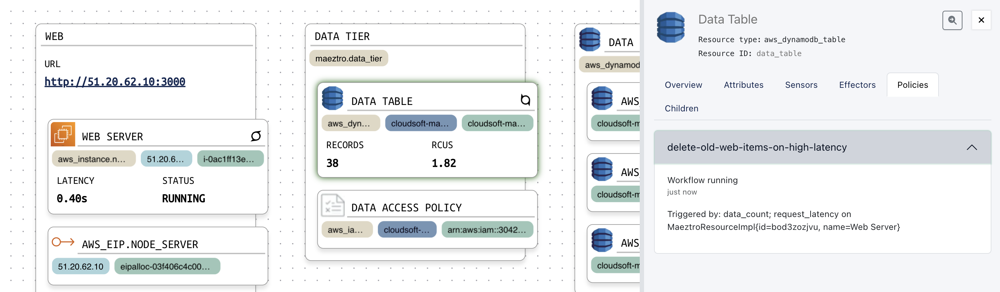

# Automating Correction Operations Using Policies

It was noted in the previous section that latency increases as the table fills up, once the app has been running for a while. Sensors provide us indications and details of problems, and effectors can restart the server or clear out the database, but having a person watching the UI (or being paged in the middle of the night) in order to verify the situation and click a button is not ideal. The smart way to approach this is to automate the resolution, subject to suitable constraints, once the problem and solution is well-understood.

## Periodic Restart Policy

Let us first define a simple policy to restart the server once per hour. This isn't actually necessary, but serves as a simple introduction. We will declare a `policy` on the `aws_instance.node_server` resource, as follows:

```hcl
maeztro extend resource "aws_instance.node_server" {

  // ... (name, parent, sensors, effectors unchanged)
  
  policy "restart-server-every-1h" {
    steps = [
      "invoke-effector restart-server"
    ]
    period = "1h"
  }
}
```

With these 6 new lines, we have a policy that runs our `restart-server` effector every hour. This technique can be used for any periodic maintenance, backups, security scans, and reporting.

**Note:** If you want to see the policy in action, try modifying the period to a smaller value, such as "2m", which will cause a restart every 2 minutes. Edit the period, `mz apply`, and see it in action.


## Reactive Database Cleanup

Responding to events, such as early indications of problems, is another useful technique. To do this, we specify the sensors which act as `triggers` for a policy to run. We can also specify a `condition` that has to be satisfied, to prevent the policy from running when it shouldn't. You can also specify a `condition` with a `period`, or a `period` and `triggers` (it will run periodically _and_ on the triggers), or all three. When triggers are being used, it can be very useful to indicate a `lock` to prevent policy instances from running concurrently.

Let us use these pieces to write a better policy:  whenever the `data_count` at the `aws_dynamodb_table.data_table` exceeds 10, run our `delete-old-web-items` effector:

```hcl
maeztro extend resource "aws_dynamodb_table.data_table" {

  // ... (name, parent, sensors, effectors unchanged)
  
  policy "delete-old-web-items-on-high-latency" {
    steps = [
      "invoke-effector delete-old-web-items"
    ]
    lock = "delete_policy_active"
    condition = {
      target : self.data_count,
      greater-than: 10
    }
    triggers = [
      "data_count"
    ]
  }
}
```

This policy's condition is checked whenever the trigger sensor changes, and if the condition is met -- if there are more than 10 items in the table -- the steps run. However, as we saw, more than 10 items is not always a problem: for a period after the app restarts, it is okay to have more. Let's expand the condition to require that latency exceeds 300 ms, as a list of conditions `all` of which must be true, referencing and being triggered by the sensor on the `node_server` resource:

```hcl
    condition = {
      all: [
        {
          target: self.data_count,
          greater-than : 10
        }, {
          target: aws_instance.node_server.request_latency,
          greater-than: "300ms"
        }
      ]
    }
    triggers = [
      "data_count",
      {
        entity: aws_instance.node_server,
        sensor: "request_latency"
      }
    ]
```

Edit your `*.mz` files with these changes and run `mz apply`. Or copy with: `cp ../stages/5-policies/*.mz ./`

Now, when you click in the NodeJS app and create lots of records, this policy kicks in once the threshholds are met.




## Job Done!

Now it's over to the engineers to fix the bug in the application; as the operations engineer you've now seen how you can automate around this. You've learned how to model structure, sensors, effectors, and policies; and how to `sync` your changes between local and Maeztro, and how to `apply` them. These are the core building blocks that let complex environments be brought under control.

**Note:** If you want to fix the application yourself, have a go. There is a big hint in the form of a comment on a line that says `NO_CHECK_IN`! Once fixed, you can `terraform taint && mz apply` to see Maeztro run `terraform` to apply it. You can run `terraform apply` instead if your workflow prefers, and then do an `mz sync` afterwards to sync the latest state to the server. In a Terraform Cloud world, with the Maeztro server running `terraform` to trigger the remote backend, you can use trigger updates from your pipeline via the API, CLI, or sensors. Orchestrated updates across multiple systems become much simpler, and an audit record is stored in the Inspector. Experiment and let us know what else you'd like to see.

As for next steps:

* View the [Cloudsoft AMP docs](https://docs.cloudsoft.io] to learn more, including about [workflow](https://docs.cloudsoft.io/blueprints/workflow/)
* [Get in touch](https://cloudsoft.io/contact) with us to let us know your thoughts or learn more
* `terraform destroy` to tear down the resources

It's just worth one more comment, having introduced policies which here attempt to solve the problem, we should point out full automation isn't always the right approach, and policies can be used for more mundance but extremely useful tasks involving people and processes. Instead of trying to fix the problems with `invoke-effector`, as we did here, workflow can open or update an issue in a Jira GitHub, with a link to the effector suggested to fix the problem. It can then close the issue when then problem is confirmed as resolved. Or it can request an approval from ServiceNow, running the effector only after approval is granted. Figuring out the right operational solution can still be a challenge, it might be targeted at the system or it might target other processes. Whatever it is, once you know what to do, Cloudsoft AMP provides a rich automation engine that can do it and make it clear what is being done. And the Maeztro subsystem lets it be described right next to your existing infrastructure-as-code.

